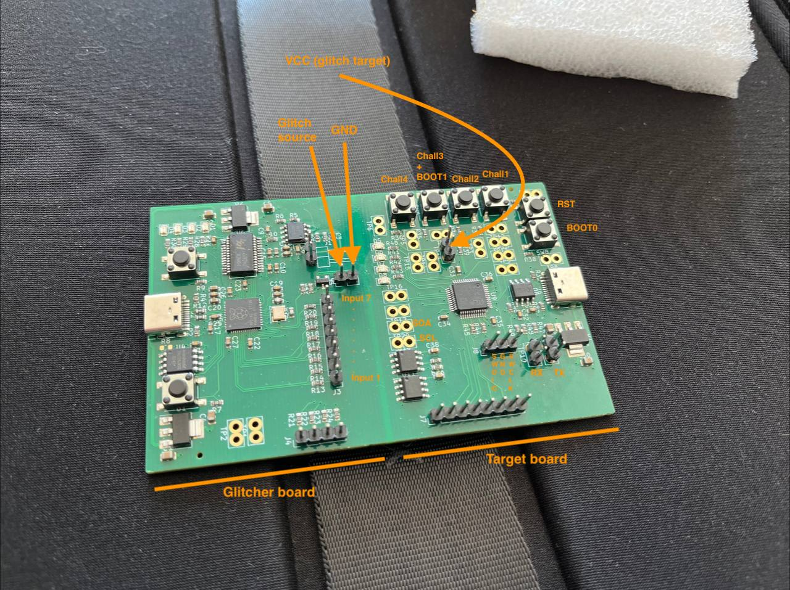

## Prototype 1 pinout
The initial prototype has a PCB consisting of 2 boards: the glitcher tool on the left, and the challenge target on the right.

The target's USB port presents a single UART device, at 115200 baud, that shows information about what it's doing.

## Glitcher Python library
Attached scope.py provides a programmable interface to the voltage scope (unused in challs), voltage glitcher, input pins (used as trigger in challs), and output pins (unused in challs). See challenge writeups for usage examples.

## Writeups

All flags have the format `ctf{A-Z0-9}`. The last two characters inside the brackets differ between boards, as they are based on their unique hardware IDs.

[Chall 1](chall1.md)

[Chall 2](chall2.md)

[Chall 3](chall3.md)

[Chall 4](chall4.md)