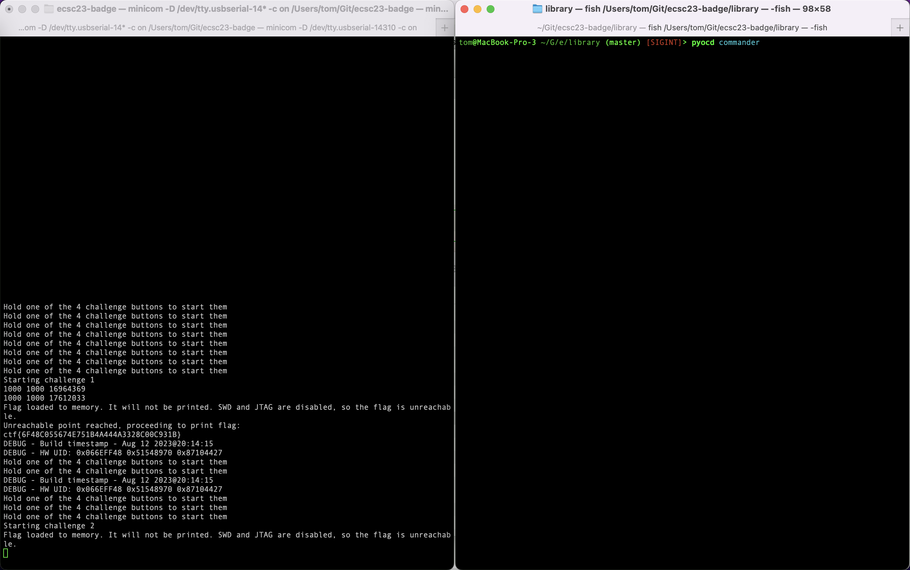
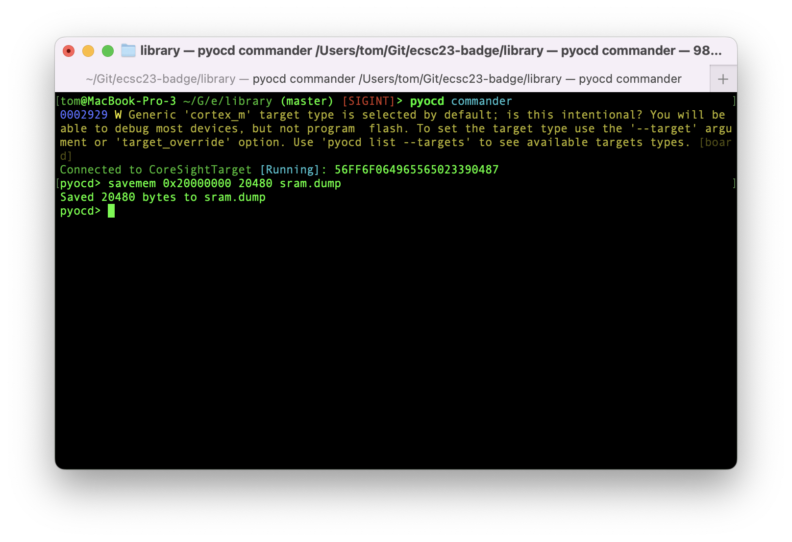
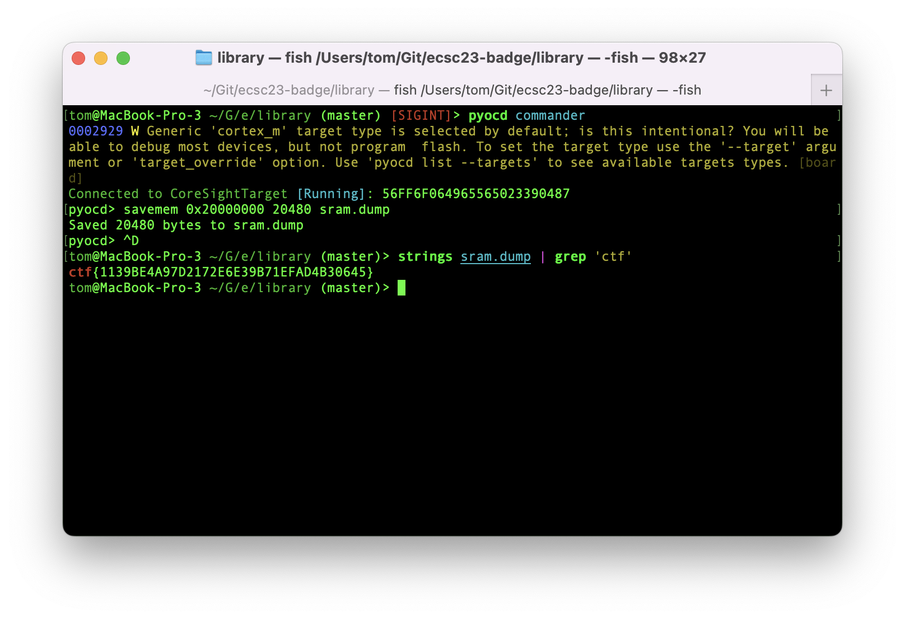

## Challenge 1

In this challenge, the flag gets loaded into RAM in plaintext. There should be no way to extract it, as JTAG and SWD have been disabled.

STM32F1 series have a design vulnerability though, where the debugging peripheral can only be disabled in software, and not through hardware fuse bits. This means that it is still accessible when an attacker can force booting from bootrom or SRAM.

Because RAM is not cleared upon reset, the flag is still there, and it can be obtained by dumping RAM.

## Repro steps
- Start the challenge by holding the chall1 button, and notice that the flag is now in SRAM.
- Force booting into the bootrom bootloader by holding BOOT0 and pressing RST. JTAG/SWD is now accessible again.
- Attach the ST-Link debugger to SWDIO/GND/SWCLK on the target board, and connect to your computer via USB.
- Install `pyocd` using `pip3 install pyocd`.
- Run pyocd in the command mode using `pyocd commander` 

- Dump the entire SRAM 

- Search for the flag preamble, and see that the flag is right there 

