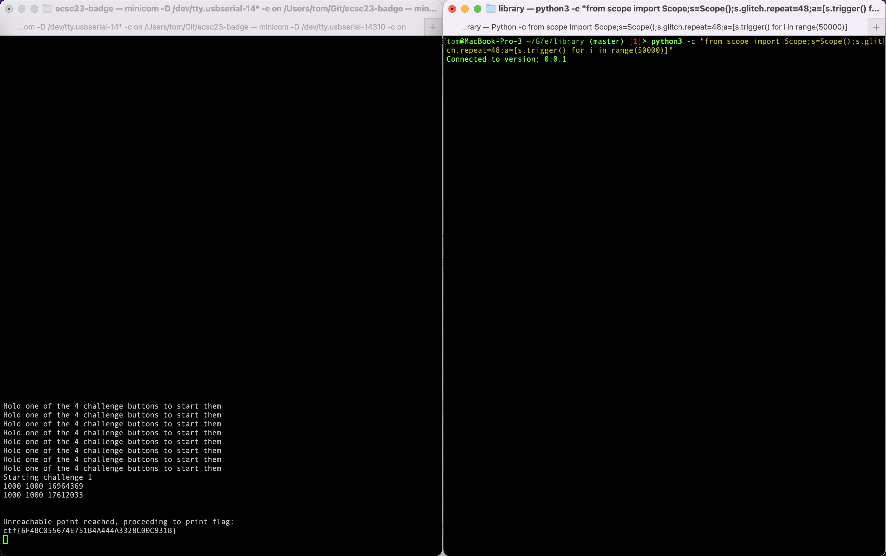

## Challenge 2

In this chall, the flag is protected by a check that is never true:

```c
  volatile bool check = true;
  uint32_t cnt = 0;
  int i = 0;
  int j;

  while (true) {
    cnt = 0;
    for (i = 0; i < 1000; i++) {
      for (j = 0; j < 1000; j++) {
        cnt++;
        if (!check) {
          // Flag gets printed
        }
      }
    }
    uart_printf("%u %u %u\r\n", i, j, cnt);
  }
```

By glitching the target board's VCC with the correct duration, register values can be corrupted and instructions can be skipped, causing the flag to be printed regardless.

## Repro steps
- Connect the glitcher's GND (next to the glitch source) to GND on the target (e.g. the middle pin of the 3-pin SWD header).
- Connect the glitcher's glitch source pin to the targets VCC header (either of the two VCC pins on the target are fine).
- Find the smallest glitch duration that triggers a complete reset of the target board, using e.g. `python3 -c "from scope import Scope;s=Scope();s.glitch.repeat=60;s.trigger()"` (s.glitch.repeat is the number of 8.3ns clock cycles to keep the glitch asserted).
- Start the challenge by holding the chall1 button, and slowly walk down the glitch duration such that the target does not reset, but `i`, `j`, and `cnt` do get corrupted. Running the challenge long enough with these corruptions results in getting the flag: 

Note: if corruption does occur, but the flag doesn't get printed, try stopping the glitch, power cycling the target board, run chall1, and start glitching again.