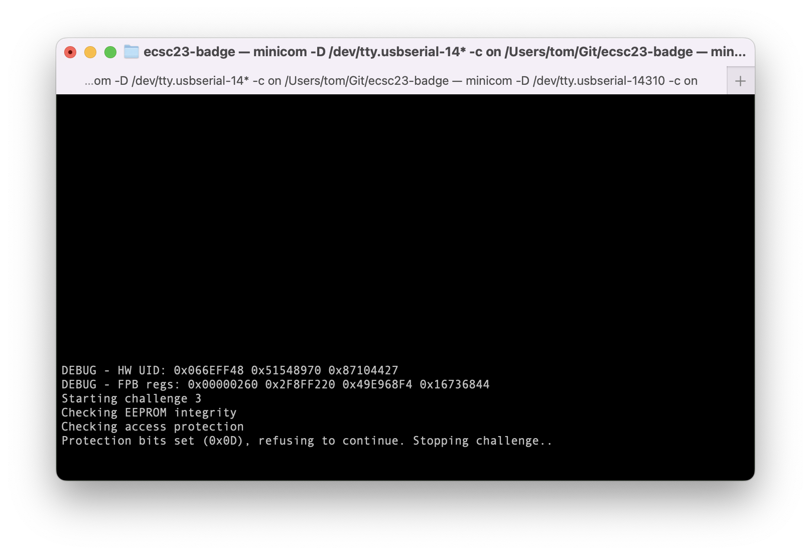

## Challenge 3

In this challenge, the flag gets printed only when certain bits in external EEPROM memory are cleared (equal to 0). Simply changing the bits on the EEPROM chip does not work, as an integrity check ensures that data on the chip has not been modified.

Attackers will use the voltage glitcher as a means to corrupt data on the i2c bus, live in-transit.

## Repro steps
- Install [Pulseview](https://sigrok.org/wiki/Downloads) to use the glitcher board as an 8-channel oscilloscope, using its input pins.
- Connect to the glitcher as a SUMP-compatible scope device. 
- Start chall3 and observe that the flag is not printed due to protection bits (with value 0x0D). 
- Hook up the scope's first two channels to the SCL and SDA pins of the target board, configure the SDA as a low edge trigger in Pulseview, and snoop the i2c bus traffic. You'll see two reads: one with data and a checksum, and then another with only data. 
- Corrupting the first read will always trigger an error stating that the EEPROM data is invalid, yet the second read has no such errors.
- Zooming in on the second read, we find that the protection bits (0x0D) are the 2nd byte that's being read. 
- Hook up both the glitcher source and the third input channel to some pin on the target board that is default-high (e.g. RX), configure the glitcher to trigger based on a falling edge of SDA, and provide some educated guess for the glitch offset (how long after triggering to start the glitch) and the glitch duration. Start chall2 to have the glitcher trigger. 
- You can study the duration and offset of your glitch in Pulseview, in the third channel: 
- The trick is now to have your glitch completely overlap with the 0x0D byte value, such that these bits all get pulled down to 0x00: 
- Once you've verified your glitch offset and duration is right, connect the glitch source pin to SDA, and arm the glitcher one last time to get the flag: 