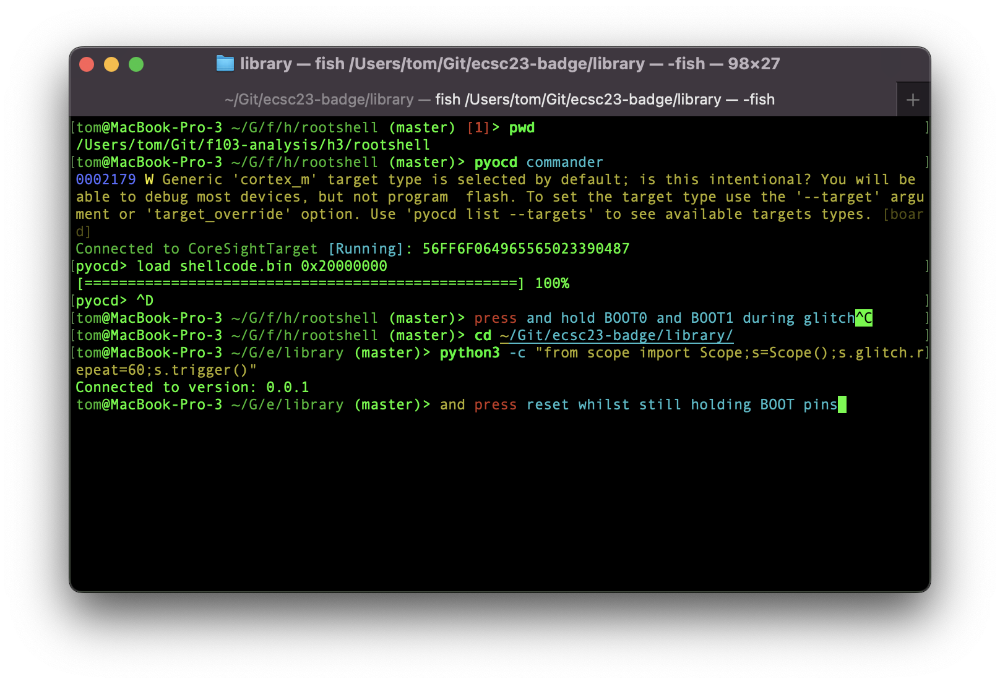
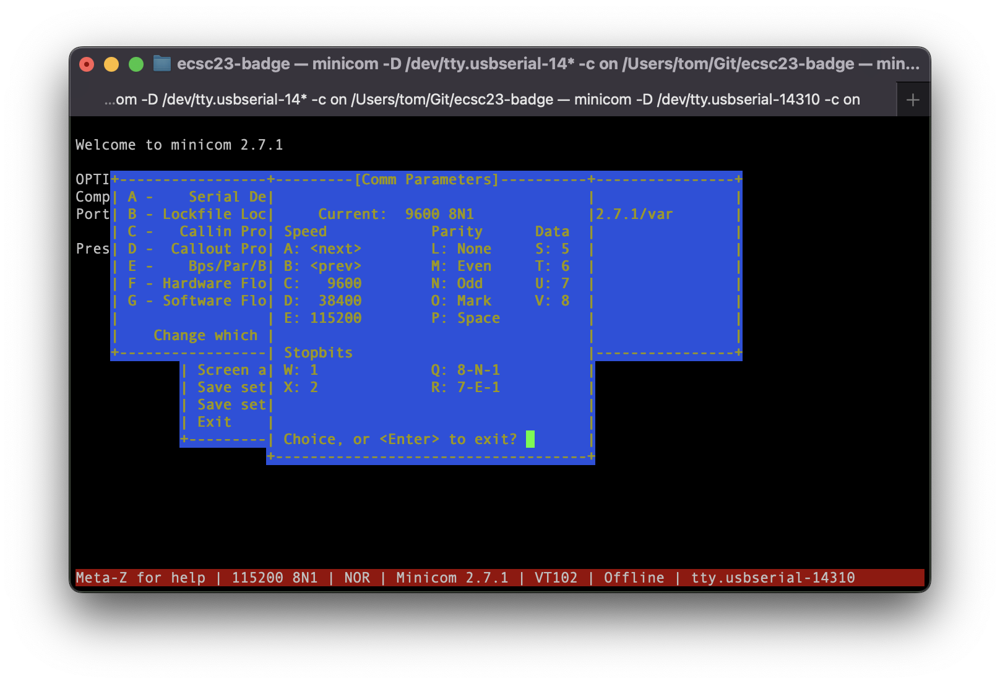
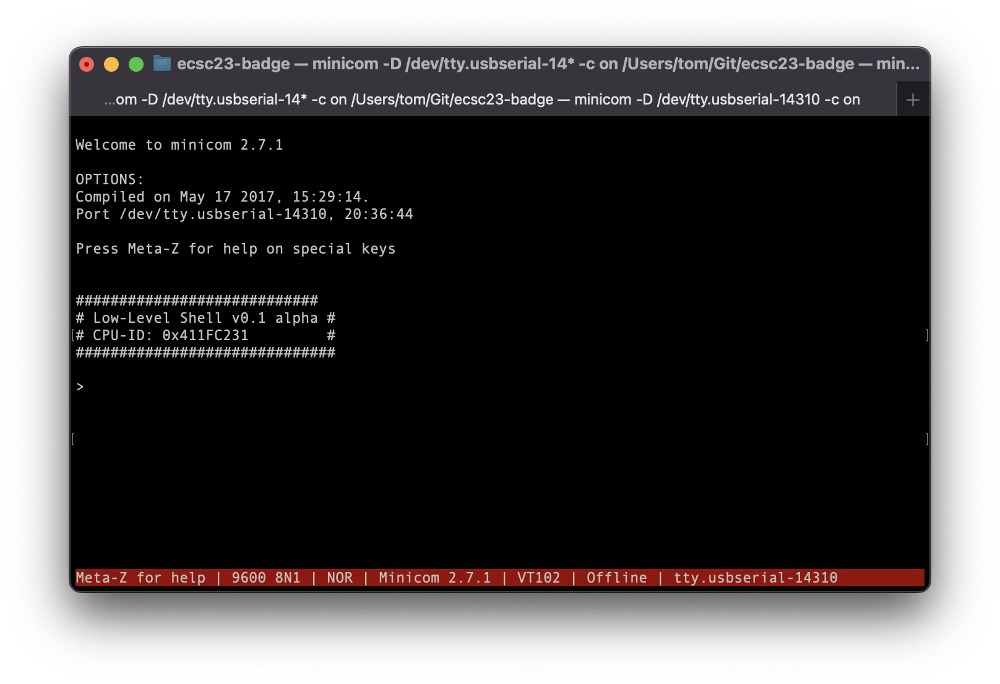
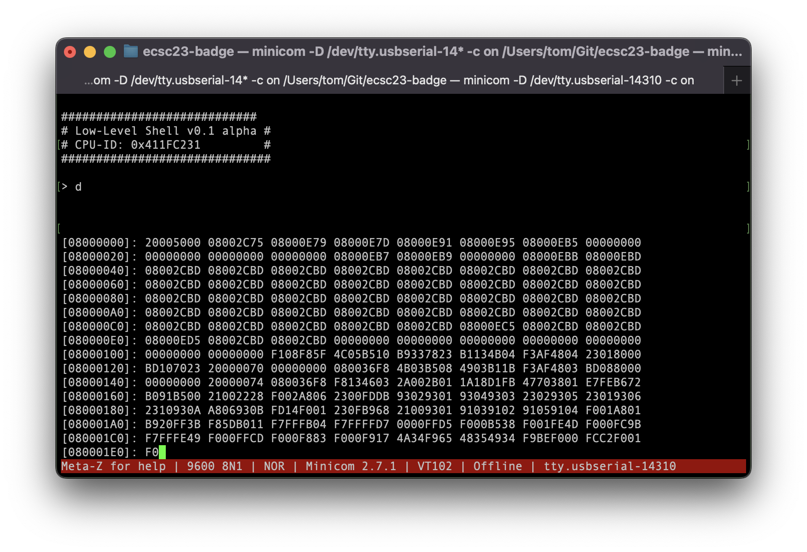
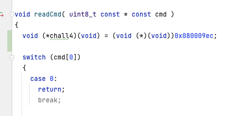
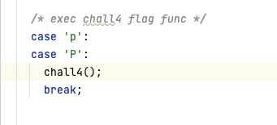
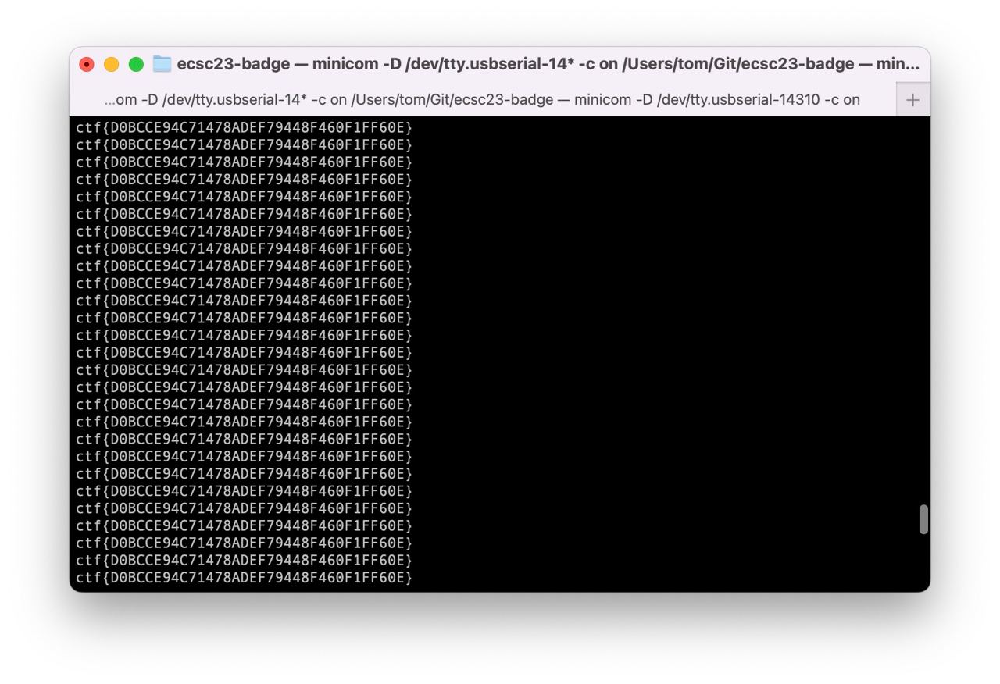

## Challenge 4

In this challenge, the flag is printed by a function that never gets called. Readout protection (RDP) is active, meaning the flash content can't be dumped, even from JTAG/SWD, the bootloader, or when booted from SRAM.

Attackers need to use a [recently published attack](https://arxiv.org/pdf/2008.09710.pdf) that uses a vulnerability in the [ARM Flash Patch and Breakpoint peripheral](https://developer.arm.com/documentation/ddi0337/h/debug/about-the-flash-patch-and-breakpoint-unit--fpb-) to enable flash access from SRAM-booted code, and then jump into the flag printing function.

## Repro steps
- Checkout the vuln author's [PoC code](https://github.com/JohannesObermaier/f103-analysis/tree/master/h3).
- This attack uses the FPB to patch the flash address space to SRAM, followed by a glitch-induced power cycle that resets the flash protection bit, without clearing SRAM. We are then booted from our own SRAM code, whilst the hardware thinks it's running from flash (thus enabling flash access).
- Following the PoC's instructions, use the SWD-enabling trick from chall2 to upload the PoC shellcode into RAM using pyocd. Then do a single power glitch to reset, whilst holding BOOT0 and BOOT1 to boot from SRAM. 
- Set up your serial terminal to 9600 baud (as that's the configured baud of the PoC code) 
- If you reset the board using the RST button whilst holding down both BOOT pins, you'll see a simple prompt: 
- If the glitched power cycle was successful, you can now dump the freshly-unprotected flash contents using the `d` command: 
- Save the contents into a binary file, and open it in e.g. Ghidra (ARM Cortex, 32 bit, little-endian, load adddress 0x08000000).
- Search for all strings, finding 'chall4 flag print function starts here', and go to the function that references it. You'll find the function at `0x080009EC`, at time of writing. Be sure to set bit 0 of the found address to 1 to have it executed in Thumb mode.
- Modify the PoC to add a new command that calls this function: 

 
- Compile and upload the new shellcode using `pyocd` again, and execute your new command.
- You'll see a bunch of gibberish being printed in your serial terminal. Change its baudrate back to 115200 to see the flag being printed in a loop. 